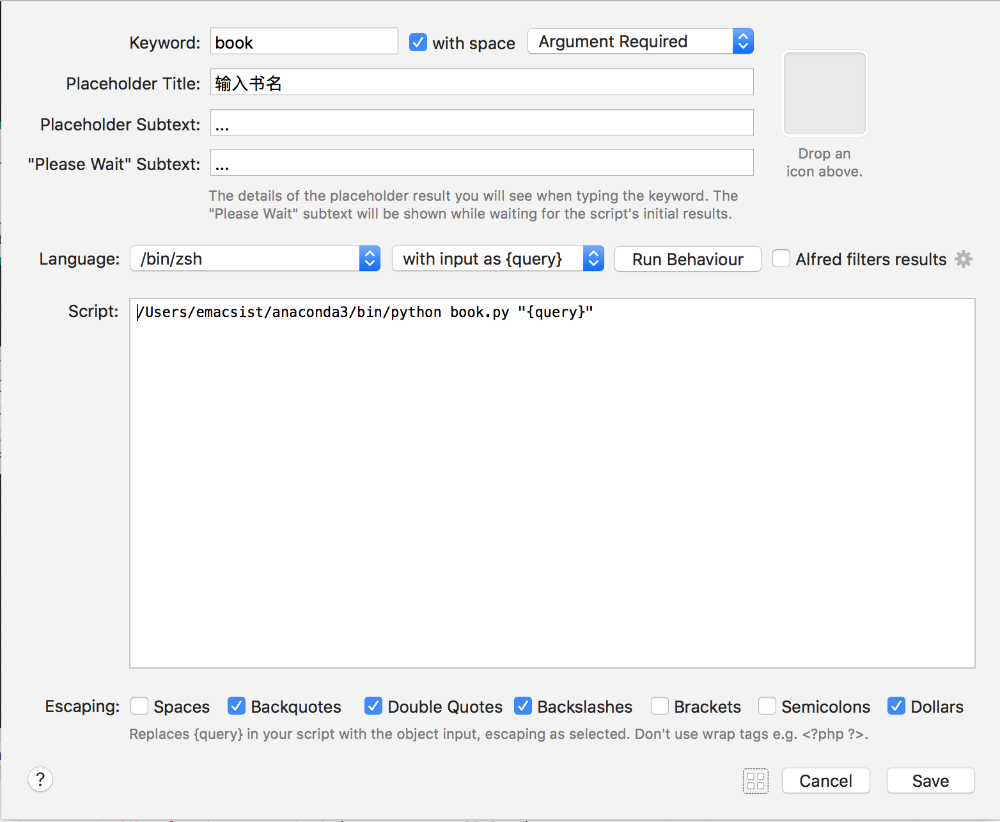
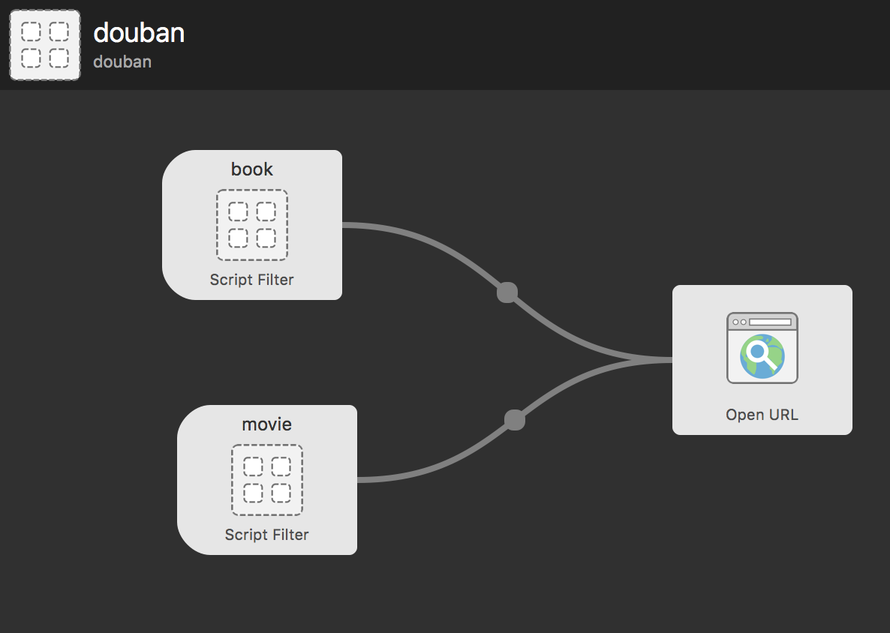
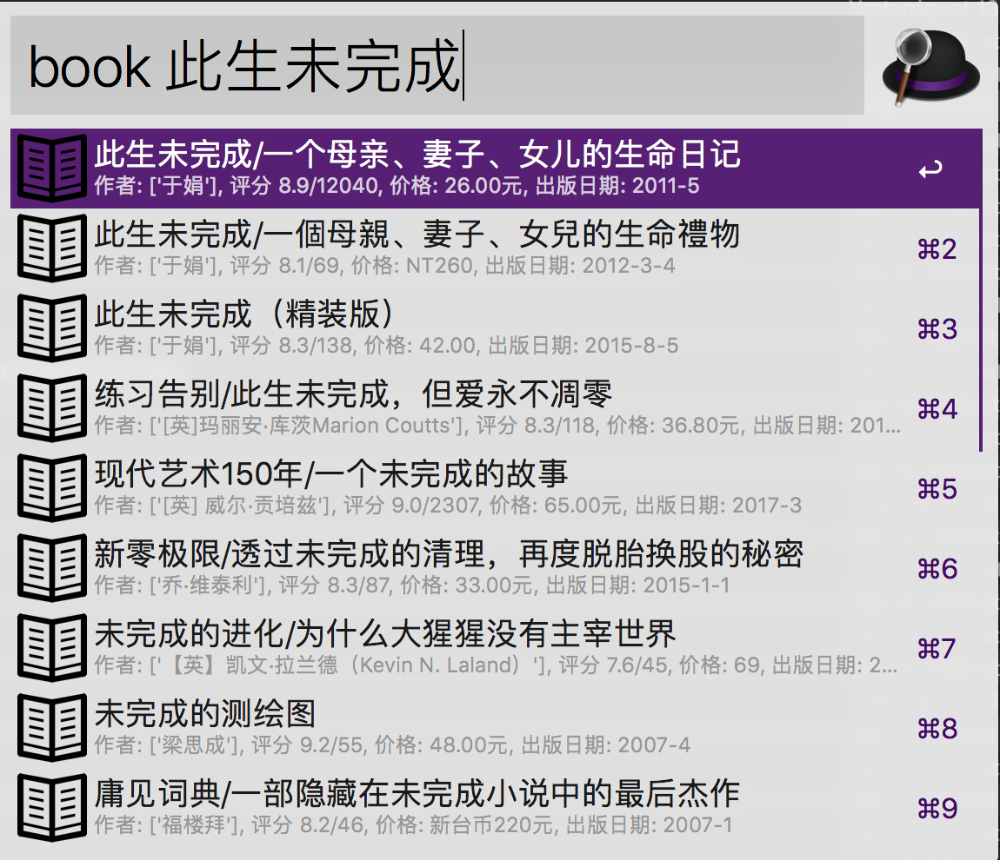

# 说明

这个不是可移植式的. 因为使用了自定义的 python 解释器来处理.

## 模块

`douban/douban-book.py` 这个是调用 douban book 的 api 来搜索书的

`douban/douban-movie.py` 这个是调用 douban movie 的 api 来搜索电影的

# 使用

创建一个空白的 workflow, 然后按下图配置:

效果如下:

# 安装

修改下 `deploy.sh` , 复制相应的文件到你创建的 workflow 工作目录即可.